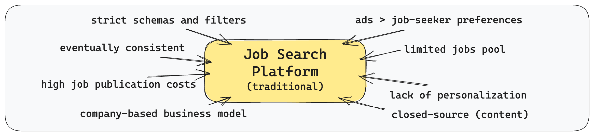

# Gandi
> Stateful Reverse Proxy for decentralized IT jobs

Gandi is shifting the closed-platform job search paradigm to a distributed, transparent and company-driven model, developing capabilities to create unique job search engines that **share the same source of content** but provide **different capabilities** to retrieve and process it
## Why?
Traditional job search tools tend to position themselves as intermediaries, but their approach often fragments the job market. Different job platforms publish unique sets of job listings, resulting in scattered and sometimes outdated information. This fragmented reality can mislead job-seekers and burden companies that struggle to keep listings up to date across multiple platforms.

Job search platforms operate more like a _black box_ than a practical tool. Companies face _competition_, huge costs for posting and advertising, and restrictions on how much information they can communicate about their vacancy.

Similarly, job-seekers struggle with _rigid search_ and filter options. Each platform restricts users to its pre-defined categories and keywords, leaving little room for a customised job search experience. In essence, these issues make job searching a daunting task rather than a smooth process.

The job search industry is also prohibitively difficult to enter from a startup solutions perspective because **it's rooted in the content problem**. We're sure there are a myriad of alternative approaches to filtering, sorting, personalised search and alerts, but they're all prohibitively difficult to implement for one simple reason: **the lack of an easy way to access corporate careers**.

### Does it have to be this way?
The unambiguous hiring goals of the company – to find the best-fit employee, and the job-seeker – to find the best-fit job, pushed us to the alternative solution space:
1. Job postings should be **as public as possible** – so that as many job-seekers as possible can find them;
2. Job platform business model **shouldn't cut off needy companies that cannot afford it**;
3. The more **personalised job search** and filtering tools that exist, the more candidates will be able to find the right vacancies;
4. Innovative job search systems **should answer the "How"** and take the "What" **for granted** to cover as many job-seeker preferences as possible.

## Approach comparison

### Non-goals
-